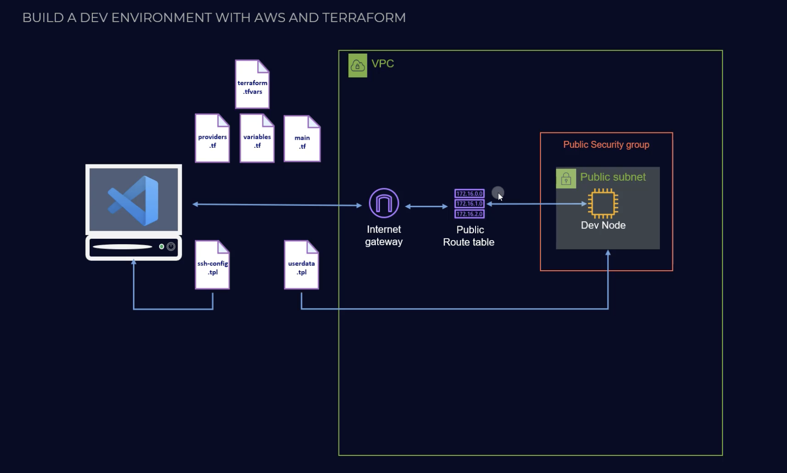

# Terraform AWS EC2 SSH Remote Access


This project demonstrates how to use Terraform to provision an entire network infrastructure on AWS, including VPC, subnets, internet gateways (IGW), security groups (SG), route tables (RT), and EC2 instances, with SSH remote access enabled. It automates the creation of these resources and manages secure remote access by configuring ingress & egress rules of security groups to your EC2 instances using SSH.

## Features

* Below if system digram that will be generated:

   
- Configures security groups for secure SSH access.
- Automates key pair creation for SSH access.
- Easily customizable instance types, key names, and regions.

## Prerequisites

Before using this project, ensure you have the following:

- [Terraform](https://www.terraform.io/downloads) installed.
- An AWS account.
- AWS CLI configured on your local machine.
- SSH client for remote access.

## Usage

1. Clone this repository to your local machine:
   ```bash
   git clone https://github.com/lalit-1729/terraform-aws-ec2-ssh-remote-access.git
2. Generate your ssh key to be able to access your project remotely.
   ```bash
   ssh-keygen -t ed25519
   ```
   * it will ask you key name, provide and replace the key in main.tf at line 111 & 84 with exact name.

3. Navigate to the project directory:
   ```bash
   cd terraform-aws-ec2-ssh-remote-access
4. Apply the Terraform configuration to create the resources:
   ```bash
   terraform init
5. Apply the Terraform configuration to create the resources:
   ```bash
   terraform apply
   ```
   * You will be prompted to confirm the creation of resources. Type yes.
   * OR use **terraform apply -auto-approve**

6. After the resources are created by Terraform find the public IP address of the EC2 instance using:
    ```bash
   terraform state show aws_instance.terraform_ec2.public_ip
   ```
7. You can SSH into the instance using the key pair:
   ```bash
   ssh -i ~/.ssh/<your_access_key> ec2-user@<EC2-Public-IP>
   ```

## Customization
You can customize the following parameters in the main.tf file:

- instance_type: Specify the EC2 instance type (e.g., t2.micro).
- key_name: Name of the SSH key pair to use.
- region: AWS region where the resources will be provisioned.

## Clean Up
To avoid unwanted costs, make sure to destroy the resources when you no longer need them:

   ```bash
   terraform destroy
   ```   
   OR 
   ```bash
   terraform apply -destroy
   ```
   OR 
   ```bash
   terraform destroy -auto-approve
   ```